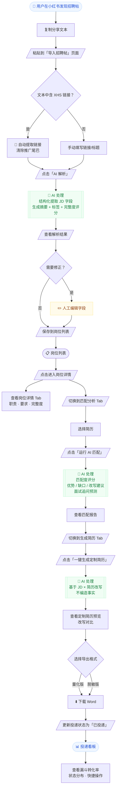
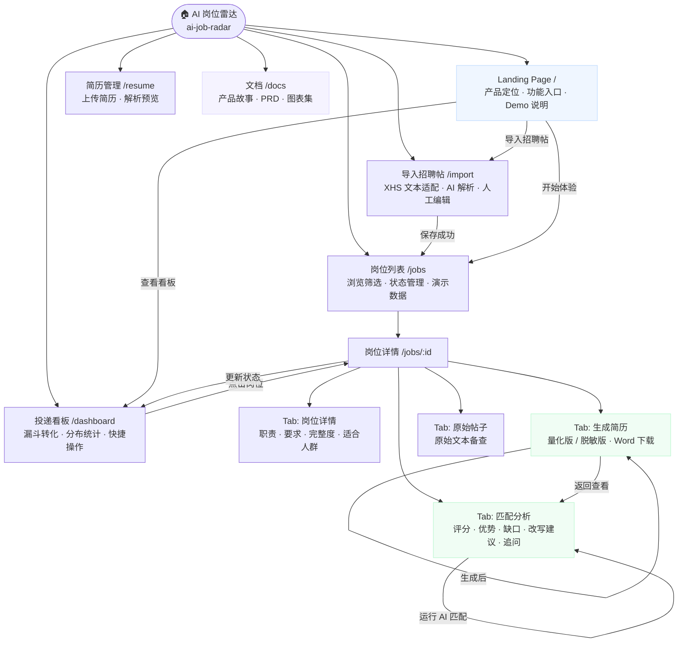
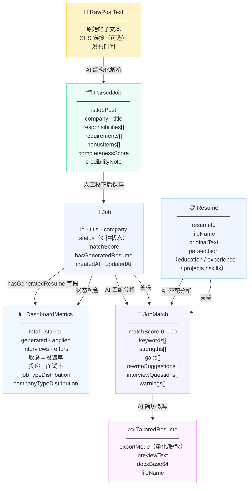

# AI 岗位雷达 · 产品图表集

> 魏智蔓 · AI 产品实习作品集 · 2026.06
>
> 以下图表使用 Mermaid 语法，可在 GitHub / Obsidian / Typora / VS Code（Markdown Preview Enhanced）等工具中直接渲染。

---

## 图 1 · 用户任务流程图

**这张图表达什么**：用户从发现帖子到管理投递进度的完整操作路径，同时标注了哪些步骤是用户动作（方框）、哪些是 AI 自动处理（绿色）、哪些是人工介入节点（黄色）。

**面试时怎么讲**：「我在设计这个产品时，把整条链路分成三段：信息获取（导入+解析）、决策支持（匹配分析）、行动落地（生成+投递）。每段 AI 做不同的事，人工在关键节点可以介入校正，这是'AI 辅助而非 AI 决策'的体现。」

**体现什么产品思维**：任务链路拆解能力；AI 与人工分工设计；在「解析结果校正」和「量化/脱敏选择」两个节点保留用户控制权，而不是全程自动化。

---

## 图 2 · 产品信息架构图

**这张图表达什么**：产品的页面层级、模块划分和主要跳转关系，以及每个页面承载的核心价值。

**面试时怎么讲**：「产品共 5 个主要页面，以岗位详情页为核心——它的四个 Tab 承载了产品最核心的三种 AI 能力。Landing Page 是对外展示的入口，它和应用本身用 Next.js Route Group 做了布局隔离，Landing 是全屏设计，应用页有侧边栏导航。」

**体现什么产品思维**：页面职责单一化；核心功能集中在岗位详情的 Tab 结构而非分散在多个页面；Landing Page 和工具页面分层，作品集展示和实际使用场景分开。

---

## 图 3 · AI 能力工作流图

```mermaid
flowchart LR
    subgraph INPUT["📥 输入层"]
        A[非结构化招聘帖文本\nXHS 分享格式 / 纯正文]
    end

    subgraph PREPROCESS["🔧 前处理（代码层）"]
        B[XHS 短链提取\nxhslink URL 识别]
        C[推广尾巴清除\n「复制后前往小红书」等]
        D[标题自动填充\n取正文首行前 40 字]
    end

    subgraph AI1["🤖 AI 任务 1：结构化解析"]
        E[岗位字段抽取\n公司 · 职责 · 要求 · 加分项]
        F[一句话 JD 摘要生成]
        G[标签提取 3–5 个]
        H[完整度评分 0–100]
        I[可信度说明]
    end

    subgraph HUMAN1["✏️ 人工确认节点 1"]
        J[查看解析结果\n可编辑所有字段\n修正 AI 误判]
    end

    subgraph AI2["🤖 AI 任务 2：JD-简历匹配"]
        K[匹配度评分 0–100]
        L[简历匹配优势\n引用简历原文]
        M[能力缺口分析\n说明补充方向]
        N[改写建议\n含 原文→改写后→改写理由]
        O[面试追问预测]
        P[⚠️ 不建议夸大的部分]
    end

    subgraph AI3["🤖 AI 任务 3：简历改写"]
        Q[基于 JD × 简历生成完整优化文本\n❌ 不编造事实\n❌ 不添加未有经历]
        R[缺失能力标注说明\n💡 建议如实告知面试官]
    end

    subgraph HUMAN2["✏️ 人工确认节点 2"]
        S[查看改写对比\n理解每处修改理由]
        T{选择导出模式}
    end

    subgraph OUTPUT["📤 输出层"]
        U[量化版 Word\n保留具体数据]
        V[脱敏版 Word\n数字模糊 · 公司名脱敏]
        W[纯文本复制]
    end

    A --> B --> C --> D --> E
    E --> F --> G --> H --> I --> J
    J --> K --> L --> M --> N --> O --> P
    P --> Q --> R --> S --> T
    T --> U
    T --> V
    T --> W

    style AI1 fill:#F0FDF4,stroke:#86EFAC
    style AI2 fill:#F0FDF4,stroke:#86EFAC
    style AI3 fill:#F0FDF4,stroke:#86EFAC
    style HUMAN1 fill:#FFFBEB,stroke:#FCD34D
    style HUMAN2 fill:#FFFBEB,stroke:#FCD34D
    style INPUT fill:#EFF6FF,stroke:#93C5FD
    style OUTPUT fill:#EFF6FF,stroke:#93C5FD
```

**这张图表达什么**：AI 不是一次性完成所有任务，而是在三个不同阶段承担不同职责（解析 → 匹配 → 改写），两个人工节点穿插其中，让用户在关键决策点可以介入和校正。

**面试时怎么讲**：「这个产品的 AI 能力是分层的。第一层是信息提取，把非结构化文本变成结构化数据；第二层是比对分析，衡量简历和岗位的匹配程度；第三层是内容生成，改写简历表达。三层 AI 之间有人工确认节点，保证不把误判带入下游。特别是改写层，Prompt 里有明确限制——不编造、不虚构，缺少证据的能力要显式标注。」

**体现什么产品思维**：AI 能力分层设计；人机协作而非全自动；可解释性设计（每条改写附理由）；产品伦理边界（不编造、脱敏保护）。

---

## 图 4 · 数据流图

**这张图表达什么**：系统内的主要数据对象及其流转关系——从非结构化文本出发，经过 AI 处理逐步变成结构化数据，最终汇聚到看板指标。

**面试时怎么讲**：「我有意在数据模型上做了一个设计决策：`hasGeneratedResume` 是独立于 `status` 的字段，因为用户可能在生成简历后又把状态改回去，但'已生成过简历'这个事实不应该丢失。这是为了让 Dashboard 的统计口径更准确。」

**体现什么产品思维**：数据建模意识；状态与事实分离（`hasGeneratedResume` vs `status`）；数据流设计服务于最终的指标体系，而不是孤立的功能设计。

---

## 图 5 · 迭代路线图

```mermaid
flowchart LR
    subgraph V0["V0 · 信息聚合验证"]
        direction TB
        V0G["🎯 验证问题\n结构化展示是否有价值？"]
        V0F["✅ 关键能力\n演示岗位列表\n四 Tab 详情结构\n基础状态筛选"]
        V0L["⚠️ 发现局限\n全靠 mock 数据\n用户无法导入真实帖子"]
    end

    subgraph V1["V1 · 招聘帖导入"]
        direction TB
        V1G["🎯 验证问题\n能否把非结构化文本变成可用 JD？"]
        V1F["✅ 关键能力\nXHS 分享文本适配\nAI 结构化解析\n解析结果可人工编辑\n重复导入检测"]
        V1L["🔑 关键决策\n解析结果支持编辑\n= AI 辅助而非 AI 决策"]
    end

    subgraph V2["V2 · 匹配分析"]
        direction TB
        V2G["🎯 验证问题\n能否量化简历与岗位的匹配程度？"]
        V2F["✅ 关键能力\n匹配度评分 0–100\n优势 / 缺口 / 改写建议\n面试追问预测\n演示简历开箱即用"]
        V2L["🔑 关键决策\n预加载演示数据\nTab 永不出现空状态"]
    end

    subgraph V3["V3 · 简历生成闭环"]
        direction TB
        V3G["🎯 验证问题\n能否从「知道怎么改」到「改好可以用」？"]
        V3F["✅ 关键能力\n量化版 / 脱敏版生成\nWord 下载\n改写对比展示\n投递看板 + 快捷操作\nLanding Page"]
        V3L["🔑 关键决策\n不编造事实原则\nDashboard 嵌入操作"]
    end

    subgraph V4["V4 · 规划中"]
        direction TB
        V4G["🎯 待验证\n真实用户场景下\n全链路能否跑通？"]
        V4F["📋 规划能力\n真实 Word 简历上传\n浏览器插件剪藏\n云端数据同步\n多用户账号系统\n岗位推荐算法\n面试准备模块"]
    end

    V0 -->|发现：需要真实导入能力| V1
    V1 -->|发现：需要量化匹配依据| V2
    V2 -->|发现：需要打通到生成和管理| V3
    V3 -->|发现：需要真实用户验证| V4

    style V0 fill:#FEF3C7,stroke:#F59E0B
    style V1 fill:#ECFDF5,stroke:#10B981
    style V2 fill:#EFF6FF,stroke:#3B82F6
    style V3 fill:#F5F3FF,stroke:#8B5CF6
    style V4 fill:#F9FAFB,stroke:#9CA3AF
```

**这张图表达什么**：每个版本不是随意堆功能，而是由上一版的「发现局限」推动到下一版——每次迭代都在验证一个具体假设，并在发现新问题后决定下一步方向。

**面试时怎么讲**：「我的迭代逻辑是先用最小能力验证核心假设。V0 验证结构化展示有没有价值，发现没有导入能力就没用；V1 解决了导入，发现用户还是不知道该不该投；V2 加了匹配分析，发现知道怎么改但改起来还是费劲；V3 才打通了完整闭环。这不是提前规划好的，是从局限倒推出来的。」

**体现什么产品思维**：假设驱动的迭代思维；每次迭代聚焦解决一个核心问题而不是堆功能；从用户痛点出发而非技术能力出发决定优先级。

---

## 图 6 · 面试讲述图（产品思维全景）

```mermaid
flowchart TD
    subgraph PROB["1️⃣ 问题发现"]
        P1[招聘帖分散且非结构化]
        P2[简历定制成本高 1–2h/次]
        P3[投递进度无工具管理]
        P4[改写方向模糊 靠感觉]
    end

    subgraph CHAIN["2️⃣ 用户任务链路拆解"]
        C["发现岗位 → 判断匹配 → 改简历\n→ 投递 → 跟踪进度\n每步割裂 · 全程手动"]
    end

    subgraph HYP["3️⃣ 产品假设"]
        H1[结构化 → 30秒判断是否值得深看]
        H2[匹配量化 → 改写方向更清晰]
        H3[量化/脱敏模式 → 覆盖不同场景]
        H4[看板嵌入操作 → 持续使用]
        H5[不编造原则 → 建立用户信任]
    end

    subgraph MVP["4️⃣ MVP 边界（有意放弃）"]
        M1[❌ 不做爬虫\n合规风险高 · 与核心价值无关]
        M2[❌ 不做账号系统\n单用户链路验证优先]
        M3[❌ 不做真实简历解析\n演示简历验证下游链路]
    end

    subgraph DEC["5️⃣ 关键产品决策"]
        D1[解析结果可人工编辑\nAI 辅助而非 AI 决策]
        D2[不编造事实\n每条改写附理由]
        D3[量化版 / 脱敏版双模式\n覆盖不同投递场景]
        D4[Dashboard 承接下一步行动\n看板即工作台]
        D5[手动粘贴公开分享文本\n合规边界清晰]
    end

    subgraph ITER["6️⃣ 功能迭代路径"]
        I["V0 演示岗位列表\n→ V1 招聘帖导入\n→ V2 匹配分析\n→ V3 简历生成闭环\n→ V4 规划中"]
    end

    subgraph NOW["7️⃣ 当前成果"]
        N1[完整链路已跑通\n粘贴帖子 → 下载 Word 约 15 分钟]
        N2[Mock 模式保证演示稳定]
        N3[Landing Page 对外说明产品定位]
        N4[PRD + 产品故事文档完整]
    end

    subgraph NEXT["8️⃣ 后续规划"]
        NX1[P1: 真实 Word 简历上传]
        NX2[P1: 用户测试验证指标]
        NX3[P2: 浏览器插件剪藏]
        NX4[P2: 云端数据同步]
    end

    PROB --> CHAIN --> HYP --> MVP --> DEC --> ITER --> NOW --> NEXT

    style PROB fill:#FEF3C7,stroke:#F59E0B
    style CHAIN fill:#FEF9C3,stroke:#EAB308
    style HYP fill:#ECFDF5,stroke:#10B981
    style MVP fill:#FEF2F2,stroke:#EF4444
    style DEC fill:#EFF6FF,stroke:#3B82F6
    style ITER fill:#F5F3FF,stroke:#8B5CF6
    style NOW fill:#F0FDF4,stroke:#22C55E
    style NEXT fill:#F9FAFB,stroke:#9CA3AF
```

**这张图表达什么**：把整个项目的产品思维浓缩在一张图里——从发现问题到定义假设，从划定 MVP 边界到做出关键决策，再到迭代路径和当前成果。这是面试时最适合「一图讲完项目」的总览图。

**面试时怎么讲**：「我用这张图来梳理整个项目的思路。核心是第 4 块——MVP 边界，我有意放弃了爬虫、账号系统和真实简历解析，因为这三件事的开发成本高但都不是验证核心假设所必须的。第 5 块是五个关键产品决策，每一个背后都有具体的理由，比如'不编造事实'不只是技术限制，而是产品信任的基础——用户在面试中说出被追问穿帮，产品价值就归零了。」

**体现什么产品思维**：结构化产品思维（问题→假设→边界→决策→迭代）；MVP 取舍意识；产品决策有明确理由而非拍脑袋；风险意识融入功能设计。

---

## 图表使用建议

| 图 | 最适合放的位置 | 使用场景 |
|---|---|---|
| 图 1 用户任务流程图 | README · 面试时单独展示 | 快速说明产品做什么、用户怎么用 |
| 图 2 产品信息架构图 | PRD · 面试时单独展示 | 说明页面结构和跳转逻辑 |
| 图 3 AI 能力工作流图 | README · Landing Page · 面试 | 体现 AI 能力的分层设计和伦理边界 |
| 图 4 数据流图 | PRD · 面试深入追问时展示 | 说明数据建模决策（适合技术/产品深度面） |
| 图 5 迭代路线图 | docs · 面试时单独展示 | 体现假设驱动的迭代思维 |
| 图 6 面试讲述图 | 面试时单独展示（最重要） | 1–3 分钟讲完整个项目，开场或收尾用 |

**推荐放 README 的图**：图 1、图 3（视觉冲击力强，能让访客快速理解产品价值）

**推荐放 Landing Page 的图**：图 3 的简化版（AI 工作流，体现技术含量）

**推荐面试单独展示的图**：图 6（总览图，最适合开场破冰）+ 图 5（迭代图，最适合回答「你是怎么做这个产品的」）
